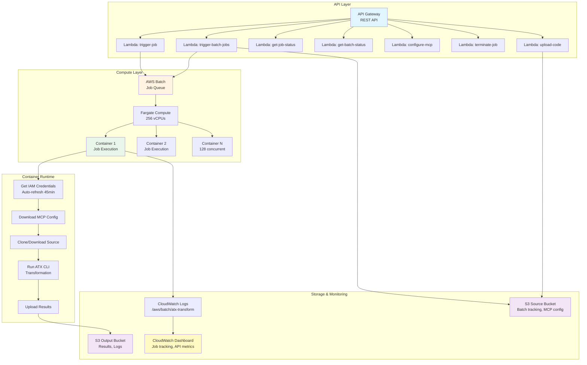

# AWS Transform custom CLI - AWS Batch Container

**Scalable, production-ready infrastructure for [AWS Transform custom](https://docs.aws.amazon.com/transform/latest/userguide/custom.html)** - Run AI-driven code transformations on 1000s of repositories in parallel using AWS Batch and Fargate.

> **⚠️ IMPORTANT:** This is sample code provided for reference and learning purposes. Before deploying to production:
> - Review and test all code thoroughly in a non-production environment
> - Customize security settings, IAM policies, and configurations for your organization's requirements
> - Understand the AWS costs associated with running this infrastructure
> - Review the [Security Guide](docs/SECURITY.md) and implement additional controls as needed
> - This code is provided "AS IS" without warranty of any kind (see LICENSE file)

## Getting Started

**Clone the repository:**
```bash
git clone https://github.com/aws-samples/aws-transform-custom-samples.git
cd aws-transform-custom-samples/scaled-execution-containers
```

## What is this?

This project provides complete infrastructure to run AWS Transform custom at enterprise scale. Deploy with one command and get a REST API, batch processing for thousands of repositories, automatic credential management, and full monitoring - all using serverless AWS services.

**One container with everything:** Java (8, 11, 17, 21), Python (3.8-3.13), Node.js (16-24), Maven, Gradle, npm, yarn, AWS Transform CLI, AWS CLI v2.

## Key Features

- 🚀 **Massive Scale** - Process 1000s of repositories concurrently with AWS Batch + Fargate
- 🔐 **Secure** - Automatic IAM credential management, no long-lived keys, auto-refresh every 45 minutes
- 📡 **REST API** - API endpoints for single job submission, job management, bulk submission, and status tracking
- 📊 **Full Monitoring** - CloudWatch dashboard with job tracking, API metrics, and real-time logs
- 🎯 **Campaign Support** - Centralized tracking and management across multiple repositories
- ⚡ **One-Command Deploy** - CDK deployment handles everything automatically
- 🔧 **Extensible** - Customize container for private repositories and additional tools

## Prerequisites

- **Docker Desktop** installed and running
- **AWS CLI v2** installed and AWS credentials configured
- **AWS account** with appropriate permissions
- **Git** and **Bash shell**
- **Node.js 18+** and **AWS CDK** (for CDK deployment only)

**Verify prerequisites:**
```bash
cd deployment
chmod +x check-prereqs.sh
./check-prereqs.sh
```

**See [cdk/README.md](cdk/README.md) or [deployment/README.md](deployment/README.md) for detailed requirements and setup instructions.**

---

## Before You Deploy

**Set AWS account and region:**
```bash
export AWS_ACCOUNT_ID=$(aws sts get-caller-identity --query Account --output text)
export CDK_DEFAULT_ACCOUNT=$AWS_ACCOUNT_ID
export CDK_DEFAULT_REGION=us-east-1
```

**Set up IAM permissions (optional but recommended):**
```bash
chmod +x generate-custom-policy.sh
./generate-custom-policy.sh
# Follow instructions to create and attach the policy
```

**Note:** If you have administrator access, skip IAM setup and proceed to deployment.

---

## Quick Start

Choose your deployment method:

### Option 1: CDK Deployment (Recommended)

```bash
# From aws-transform-custom-samples/scaled-execution-containers root
cd ../cdk
chmod +x deploy.sh
./deploy.sh
```

**Time:** 30 minutes (all resources) including building the container

**What gets deployed:**
- ECR repository with Docker image
- S3 buckets (output, source)
- IAM roles with least-privilege
- AWS Batch infrastructure (Fargate)
- 7 Lambda functions
- API Gateway REST API
- CloudWatch logs and dashboard

**See [cdk/README.md](cdk/README.md) for detailed instructions and configuration options.**

### Option 2: Bash Scripts

```bash
# From aws-transform-custom-samples/scaled-execution-containers root
./1-build-and-push.sh
./2-deploy-infrastructure.sh
./3-deploy-api.sh
```

**Time:** 20-30 minutes total

**See [deployment/README.md](deployment/README.md) for detailed instructions.**

---

## Architecture




## What's Included

The container comes with everything pre-installed:

**Java:**
- OpenJDK 8, 11, 17, 21
- Maven 3.9.6, Gradle 8.5
- Default: Java 17

**Python:**
- Python 3.8, 3.9, 3.10, 3.11, 3.12, 3.13
- pip, virtualenv, boto3, requests
- Default: Python 3.11

**Node.js:**
- Node.js 16, 18, 20, 22, 24
- npm, yarn, pnpm, TypeScript
- Default: Node.js 20

**Other:**
- AWS Transform CLI
- AWS CLI v2
- Git, build tools

## Usage Examples

### Using the API (Recommended)

Submit jobs via the REST API for easier management and monitoring.

**Run comprehensive test suite:**
```bash
cd test
chmod +x test-apis.sh
./test-apis.sh
```

This tests all 10 API endpoints including MCP configuration, transformations, bulk jobs, and campaigns.

**Or test with a single job:**
```bash
python3 utilities/invoke-api.py \
  --endpoint "$API_ENDPOINT" \
  --path "/jobs" \
  --data '{
    "source": "https://github.com/venuvasu/todoapilambda",
    "command": "atx custom def exec -n AWS/python-version-upgrade -p /source/todoapilambda -c noop --configuration \"validationCommands=pytest,additionalPlanContext=The target Python version to upgrade to is Python 3.13. Python 3.13 is already installed at /usr/bin/python3.13\" -x -t"
  }'
```

**For commands that don't need a repository (source is optional):**
```bash
# List available transformations
python3 utilities/invoke-api.py \
  --endpoint "$API_ENDPOINT" \
  --path "/jobs" \
  --data '{"command": "atx custom def list"}'

# Test MCP tools
python3 utilities/invoke-api.py \
  --endpoint "$API_ENDPOINT" \
  --path "/jobs" \
  --data '{"command": "atx mcp tools"}'
```

**See [api/README.md](api/README.md) for complete API documentation and examples.**

---

**Campaign-based transformations:** Track and manage transformations across multiple repositories with centralized monitoring. See [api/README.md](api/README.md#campaign-based-transformations) for setup and usage.

**Bulk job submission:** Submit 1000s of repositories in one API call. See [api/README.md](api/README.md#bulk-job-submission) for examples.

---

**Direct AWS Batch CLI:** For advanced users who prefer direct AWS Batch CLI. See [deployment/README.md](deployment/README.md) for examples.

---

## Configuration

**Infrastructure:** Edit `deployment/config.env` for AWS region, network, and compute settings.

**Container:** Customize the Docker image for private repositories or additional tools.  
See [container/README.md](container/README.md) for extending the base image.

**Campaigns:** Track transformations across multiple repositories with centralized monitoring.  
See [api/README.md](api/README.md#campaign-based-transformations) for campaign setup and usage.

**See [deployment/README.md](deployment/README.md) and [cdk/README.md](cdk/README.md) for complete configuration options.**

---

## Private Repositories

Customize the container to access private Git repositories and artifact registries.

**See [container/README.md](container/README.md#extending-for-private-access) for:**
- AWS Secrets Manager integration (recommended)
- GitHub, GitLab, Bitbucket private access
- Maven/Gradle private registries
- npm private registries

---

## Download Results

```bash
aws s3 sync s3://atx-custom-output-ACCOUNT_ID/transformations/ ./local-results/
```

---

## Troubleshooting

See [docs/TROUBLESHOOTING.md](docs/TROUBLESHOOTING.md) for detailed troubleshooting.

**Quick debug:**
```bash
# View logs in CloudWatch
aws logs tail /aws/batch/atx-transform --follow --region us-east-1

# Check job status
aws batch describe-jobs --jobs <JOB_ID> --region us-east-1
```

## Documentation

- **[Deployment Guide](deployment/README.md)** - Deployment scripts and options
- **[CDK Deployment](cdk/README.md)** - CDK deployment guide
- **[API Documentation](api/README.md)** - REST API for job management
- **[Container Details](container/README.md)** - What's included in the container
- **[Troubleshooting](docs/TROUBLESHOOTING.md)** - Common issues and solutions
- **[Security Guide](docs/SECURITY.md)** - Security best practices

---

## Cost Estimate

**Infrastructure (monthly):**
- ECR storage: ~$0.35/month (~3.5GB image)
- S3 storage: ~$0.023/GB/month
- CloudWatch Logs: ~$0.50/GB ingested
- Networking: $0/month (public subnets)

**Compute (per job):**
- Fargate: ~$0.04/vCPU-hour + $0.004/GB-hour
- Example: 2 vCPU, 4GB, 1 hour = ~$0.20

**AWS Transform custom**
- $0.035 / agent minute
- Agent minutes reflect the amount of work an agent spends on your transformation tasks

## Utilities

Helper scripts for API access and monitoring:

- **utilities/invoke-api.py** - API invocation with automatic IAM signing
- **utilities/tail-logs.py** - Real-time job log monitoring

## Cleanup

To remove all deployed resources:

**CDK Deployment:**
```bash
cd cdk
./destroy.sh
```

**Bash Scripts Deployment:**
```bash
cd deployment
./cleanup.sh
```

Deletes all AWS resources including Batch, Lambda, API Gateway, S3 buckets, IAM roles, and CloudWatch resources.


## Support

For issues:
1. Check [docs/TROUBLESHOOTING.md](docs/TROUBLESHOOTING.md)
2. Review CloudWatch logs in AWS Console or via AWS CLI
3. Verify IAM role has AWSTransformCustomFullAccess policy
4. Check network configuration (internet access required)

## License

See LICENSE file for details.
